#### 基于TX-LCN框架的分布式事务Demo实现及总结

------

**框架背景**

​	LCN框架早期设计步骤为：锁定事务单元(lock)、确认事务模块状态(confirm)、通知事务(notify)，各取其首字母得名。框架从2017年6月份发布的1.0版本，到现在已经发展到了5.0.2版本。5.0以后由于框架兼容了LCN、TCC、TXC三种事务模式，改名为TX-LCN分布式事务框架。

##### 事务控制原理

​	TX-LCN由两大模块组成, TxClient、TxManager，TxClient作为模块的依赖框架，提供TX-LCN的标准支持，TxManager作为分布式事务的控制放。事务发起方或者参与方都由TxClient端来控制。

原理图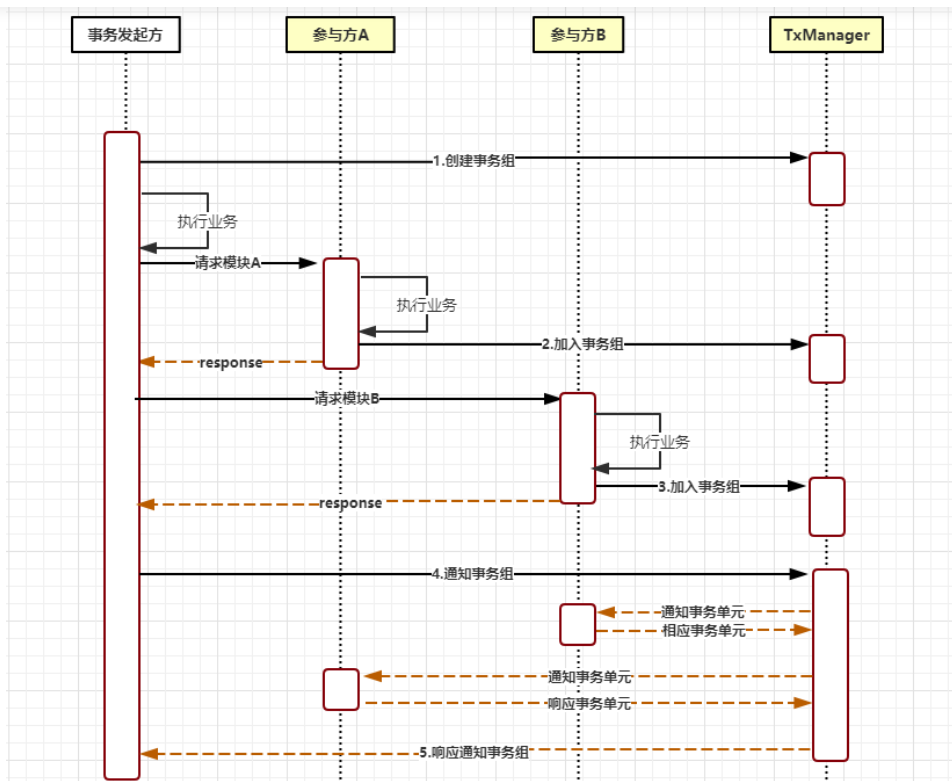

核心步骤

- 创建事务组
  是指在事务发起方开始执行业务代码之前先调用TxManager创建事务组对象，然后拿到事务标示GroupId的过程。
- 加入事务组
  添加事务组是指参与方在执行完业务方法以后，将该模块的事务信息通知给TxManager的操作。
- 通知事务组
  是指在发起方执行完业务代码以后，将发起方执行结果状态通知给TxManager,TxManager将根据事务最终状态和事务组的信息来通知相应的参与模块提交或回滚事务，并返回结果给事务发起方。

------

##### 使用示例

​	TX-LCN 主要有两个模块，Tx-Client(TC) Tx-Manager(TM). TC作为微服务下的依赖，TM是独立的服务。

##### 一、准备开发环境

开发工具：IDEA，Git

依赖： JDK1.8+，SpringBoot2.0.7,  SpringCloud Finchley.SR2，Consul，Mysql5.6+,  Redis3.2(可选)

------

##### 二、初始化数据

此示例采用创建订单为基本事务，共涉及3个微服务模块。为了简单演示，3个服务使用同一个数据库，创建3张表分别为Orders(订单表)，User(用户表)，Stock(库存表)。

创建Mysql数据库

```mysql
create database if not exists `txlcn-demo` default charset utf8 collate utf8_general_ci;
```

创建数据库表

```mysql
CREATE TABLE `orders` (
  `id` int(10) NOT NULL AUTO_INCREMENT,
  `group_id` varchar(64) DEFAULT NULL,
  `goods_name` varchar(255) DEFAULT NULL,
  `goods_count` int(11) DEFAULT NULL,
  `app_name` varchar(128) DEFAULT NULL,
  `create_time` datetime DEFAULT NULL,
  PRIMARY KEY (`id`)
) ENGINE=InnoDB AUTO_INCREMENT=48 DEFAULT CHARSET=utf8 ROW_FORMAT=DYNAMIC;
```

```mysql
CREATE TABLE `user` (
  `id` int(10) NOT NULL AUTO_INCREMENT,
  `group_id` varchar(64) DEFAULT NULL,
  `username` varchar(255) DEFAULT NULL,
  `app_name` varchar(128) DEFAULT NULL,
  `vip` int(1) DEFAULT '0',
  PRIMARY KEY (`id`)
) ENGINE=InnoDB AUTO_INCREMENT=4 DEFAULT CHARSET=utf8 ROW_FORMAT=DYNAMIC;
```

```mysql
CREATE TABLE `stock` (
  `id` int(10) unsigned NOT NULL AUTO_INCREMENT,
  `group_id` varchar(64) DEFAULT NULL,
  `app_name` varchar(255) DEFAULT NULL,
  `goods_name` varchar(255) DEFAULT NULL,
  `goods_amount` int(10) DEFAULT NULL,
  PRIMARY KEY (`id`)
) ENGINE=InnoDB AUTO_INCREMENT=4 DEFAULT CHARSET=utf8;
```

------

##### 三、启动TxManager(TM)

1、新建SpringBoot模块

2、新增依赖

```java
<dependency>
    <groupId>com.codingapi.txlcn</groupId>
    <artifactId>txlcn-tm</artifactId>
    <version>5.0.2.RELEASE</version>
</dependency>
```

3、在主类上标注 @EnableTransactionManagerServer

```java
@SpringBootApplication
@EnableTransactionManagerServer
public class TransactionManagerApplication {

  public static void main(String[] args) {
      SpringApplication.run(TransactionManagerApplication.class, args);
  }
  
}
```

4、配置application.properties

```java
spring.application.name=TransactionManager
server.port=7970
#配置TxManager管理系统后台密码
tx-lcn.manager.admin-key=123456

spring.datasource.driver-class-name=com.mysql.jdbc.Driver
spring.datasource.url=jdbc:mysql://127.0.0.1:3306/tx-manager?characterEncoding=UTF-8&serverTimezone=Asia/Shanghai
spring.datasource.username=root
spring.datasource.password=
spring.jpa.database-platform=org.hibernate.dialect.MySQL5InnoDBDialect
spring.jpa.hibernate.ddl-auto=update

mybatis.configuration.map-underscore-to-camel-case=true
mybatis.configuration.use-generated-keys=true

#tx-lcn.logger.enabled=true
# TxManager Host Ip
#tx-lcn.manager.host=127.0.0.1
# TxClient连接请求端口
#tx-lcn.manager.port=8070
# 心跳检测时间(ms)
#tx-lcn.manager.heart-time=15000
# 分布式事务执行总时间
#tx-lcn.manager.dtx-time=30000
#参数延迟删除时间单位ms
#tx-lcn.message.netty.attr-delay-time=10000
#tx-lcn.manager.concurrent-level=128
# 开启日志
#tx-lcn.logger.enabled=true
#logging.level.com.codingapi=debug
#redis 主机
#spring.redis.host=127.0.0.1
#redis 端口
#spring.redis.port=6379
#redis 密码
#spring.redis.password=
```

5、运行TransactionManagerApplication。访问<http://localhost:7970>  ,输入配置的密码可看到：

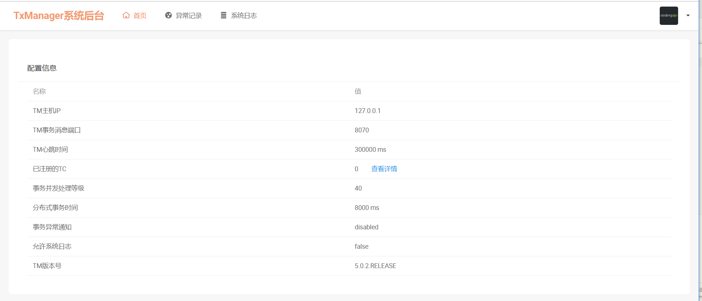

------

##### 四、配置微服务模块

微服务共三个模块：

创建订单 spring-service-a (发起方)

检查用户 spring-service-b (参与方)

检查库存 spring-service-c（参与方）

1、调用关系说明

(1)、SpringServiceA ->OrderController 的 saveorder 的Mapping是调用发起方法,代码如下。

```java
package org.txlcn.demo.servicea;

import org.springframework.beans.factory.annotation.Autowired;
import org.springframework.web.bind.annotation.RequestMapping;
import org.springframework.web.bind.annotation.RequestParam;
import org.springframework.web.bind.annotation.RestController;

@RestController
public class OrderController {

    private final OrderService orderService;

    @Autowired
    public OrderController(OrderService orderService) {
        this.orderService = orderService;
    }

    @RequestMapping("/saveorder")
    public String saveOrder(@RequestParam("username") String username, @RequestParam("goodsname") String goodsName, @RequestParam("count") int count) {
        return orderService.saveOrder(username, goodsName, count);
    }
    
}
```

(2)、orderService.saveOrder(username, goodsName, count)具体代码

```java
 public String saveOrder(String username, String goodsName, int count) {

        // step1. 创建订单
        Orders orders = new Orders();
        orders.setGroupId(TracingContext.tracing().groupId());
        orders.setAppName(Transactions.getApplicationId());
        orders.setGoodsName(goodsName);
        orders.setGoodsCount(count);
        orders.setCreateTime(new Date());
        orderMapper.saveOrders(orders);
        String orderResp = "创建订单： 商品名称-" + goodsName + "- 数量-" + count;
        //step2. 检查用户是否为企业用户
        String checkResp = serviceBClient.checkUser(username);
        //String checkResp = restTemplate.getForObject("http://127.0.0.1:12002/checkuser?username=" + username, String.class);

        //step3. 检查库存
        String stockResp = serviceCClient.checkStock(goodsName, count);
        /*String stockResp = restTemplate.getForObject("http://127.0.0.1:12003/checkstock?goodsname=" + goodsName + "&count=" + count, String.class);*/

        if (checkResp.equals("fallback-b")) {
            return "非企业用户，订单创建失败";
        }
        if (stockResp.equals("fallback-c")) {
            return "库存不足，订单创建失败";
        }
        return orderResp + "  >>>>>>>>>>" + checkResp + "  >>>>>>>>>>" + stockResp + "  >>>>>>>>>>" + "创建成功，事务执行完毕";

    }
```

(3)、ServiceBClient.checkUser(username)代码

```java
    @Override
    @TxcTransaction(propagation = DTXPropagation.SUPPORTS)
    @Transactional
    public String checkUser(String username) {                  //检查是否为企业用户
        String checkResp;
        int vipCode = userMapper.checkifVip(username);
        String appName = Transactions.getApplicationId();
        String groupId = TracingContext.tracing().groupId();
        userMapper.updateUser(groupId, appName, username);
        if (vipCode != 1) {
            throw new IllegalStateException("sorry ,you are not vip user");
        } else {
            checkResp = "验证用户为企业用户，可以下单";
        }
        return checkResp;
    }
```

(4)、ServiceCClient.checkStock(goodsname,count)代码

```java
    @Override
    @TxcTransaction(propagation = DTXPropagation.SUPPORTS)
    @Transactional
    public String checkStock(String goodsName, int count) {            //检查库存是否充足
        String msg;
        int goods_amount = stockMapper.selectAmountbyGoodsName(goodsName);
        if (goods_amount < count) {
            throw new IllegalStateException("sorry , goods stock is not enough");
        } else {
            int newAmount = goods_amount - count;
            String groupId = TracingContext.tracing().groupId();
            String appName = Transactions.getApplicationId();
            stockMapper.updateStock(newAmount, groupId, appName, goodsName);

            if (newAmount > 10) {
                msg = "库存充足，可放心下单";
            } else {
                msg = "还有少量库存，请尽快下单";
            }
        }
        return goodsName + msg;
    }
```

2、工程代码概览

(1)、事务发起方 txlcn-demo-spring-service-a 创建订单

- 工程结构

  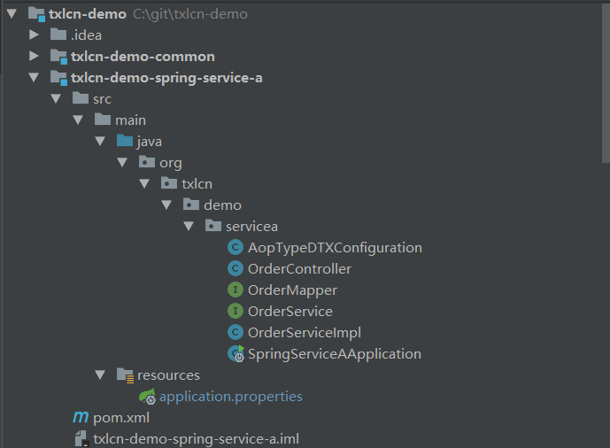

- 配置文件

```java
# 你可以在 https://txlcn.org/zh-cn/docs/setting/client.html 看到所有的个性化配置
spring.application.name=txlcn-demo-spring-service-a
server.port=13001
spring.datasource.driver-class-name=com.mysql.jdbc.Driver
## 个人配置
spring.datasource.url=jdbc:mysql://127.0.0.1:3306/txlcn-demo?useSSL=false&characterEncoding=UTF-8&serverTimezone=Asia/Shanghai
spring.datasource.username=root
spring.datasource.password=

spring.datasource.hikari.maximum-pool-size=20
mybatis.configuration.map-underscore-to-camel-case=true
mybatis.configuration.use-generated-keys=true
        
tx-lcn.client.manager-address=127.0.0.1:8070

spring.cloud.consul.host=127.0.0.1
spring.cloud.consul.port=8500

tx-lcn.ribbon.loadbalancer.dtx.enabled=true
feign.hystrix.enabled=true
# 关闭Ribbon的重试机制（如果有必要）
ribbon.MaxAutoRetriesNextServer=0
ribbon.ReadTimeout=5000
ribbon.ConnectTimeout=5000
```

(2)、事务参与方 txlcn-demo-spring-service-b 检查是否为企业用户

- 工程结构

  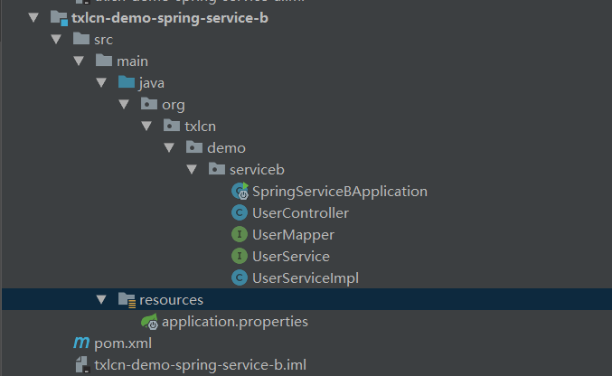

- 配置文件

```java
spring.application.name=txlcn-demo-spring-service-b
server.port=13002
spring.datasource.type=com.alibaba.druid.pool.DruidDataSource
spring.datasource.driver-class-name=com.mysql.jdbc.Driver

tx-lcn.ribbon.loadbalancer.dtx.enabled=true
## TODO 你的配置
spring.datasource.url=jdbc:mysql://127.0.0.1:3306/txlcn-demo?useSSL=false&characterEncoding=UTF-8&serverTimezone=Asia/Shanghai
spring.datasource.username=root
spring.datasource.password=
#spring.datasource.hikari.maximum-pool-size=20
mybatis.configuration.map-underscore-to-camel-case=true
mybatis.configuration.use-generated-keys=true

## tx-manager 配置
tx-lcn.client.manager-address=127.0.0.1:8070

#注册服务
spring.cloud.consul.host=127.0.0.1
spring.cloud.consul.port=8500
```

(3) 、事务参与方 txlcn-demo-spring-service-c 检查库存

- 工程结构

  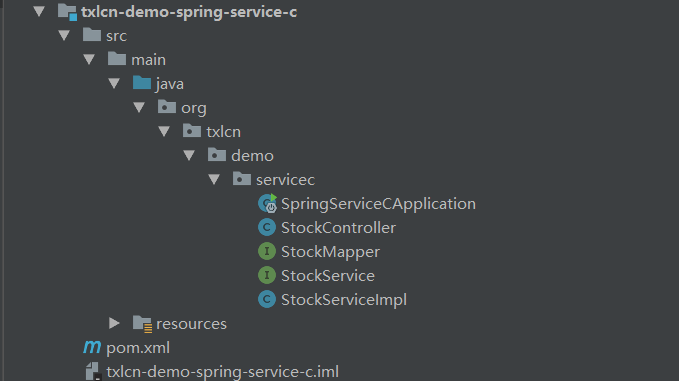

- 配置文件

  ```java
  spring.application.name=txlcn-demo-spring-service-c
  server.port=13003
          
  ## TODO 你的配置
  spring.datasource.driver-class-name=com.mysql.jdbc.Driver
  spring.datasource.url=jdbc:mysql://127.0.0.1:3306/txlcn-demo?useSSL=false&characterEncoding=UTF-8&serverTimezone=Asia/Shanghai
  spring.datasource.username=root
  spring.datasource.password=
  spring.datasource.hikari.maximum-pool-size=20
  mybatis.configuration.map-underscore-to-camel-case=true
  mybatis.configuration.use-generated-keys=true
          
  ## tx-manager 配置
  tx-lcn.client.manager-address=127.0.0.1:8070
  ##注册服务
  spring.cloud.consul.host=127.0.0.1
  spring.cloud.consul.port=8500
  tx-lcn.ribbon.loadbalancer.dtx.enabled=true
  ```

  3.启动微服务      依此启动每个工程的主类

  访问<http://localhost:8500> ,可见3个服务均已在consul中注册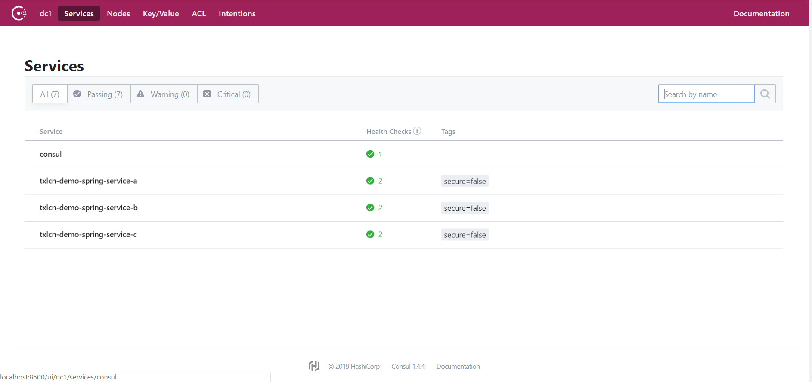

  访问TxManager系统后台<http://localhost:7970>，可见如下图：

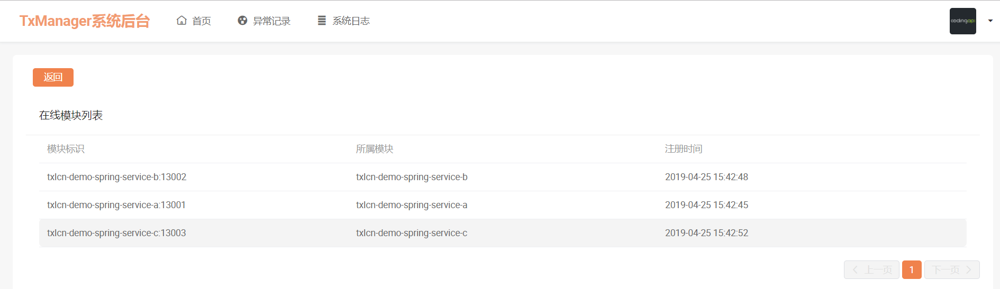

------

##### 五、启动模块与测试

1、开始订单表为空

​	 用户表

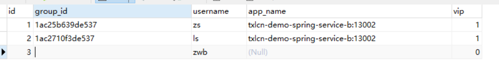

​	库存表

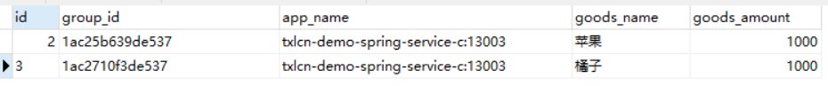

2、典型样例测试

(1)、用户为企业用户，库存充足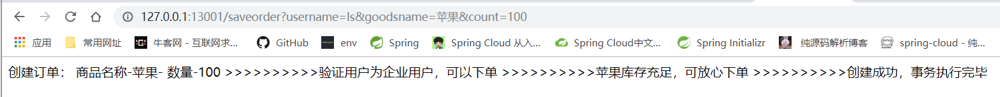

数据库订单表新增订单，库存表苹果库存-100

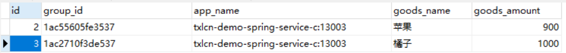

(2)、用户为非企业用户，库存充足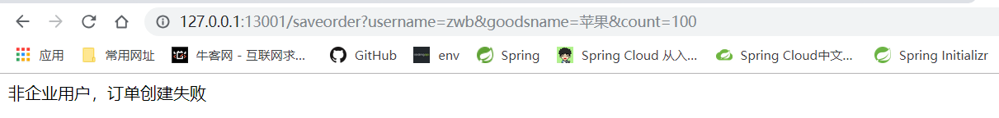

数据库订单不增加，库存表库存不变，说明事务发生了回滚。

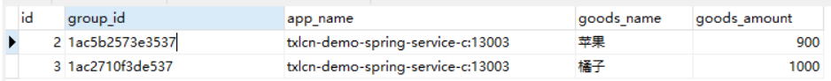

(3)、用户为企业用户，库存不足

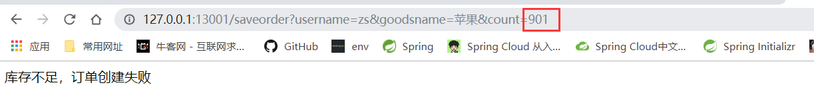

数据库订单不增加，库存表库存不变，说明事务发生了回滚。

------

##### 六、总结

1、在一个分布式系统下存在多个模块协调来完成一次业务。那么就存在一次业务事务下可能横跨多种数据源节点的可能。TX-LCN就可以解决这样的问题。

​    例如存在服务模块A 、B、 C。A模块是mysql作为数据源的服务，B模块是基于redis作为数据源的服务，C模块是基于mongo作为数据源的服务。若需要解决他们的事务一致性就需要针对不同的节点采用不同的方案，并且统一协调完成分布式事务的处理。

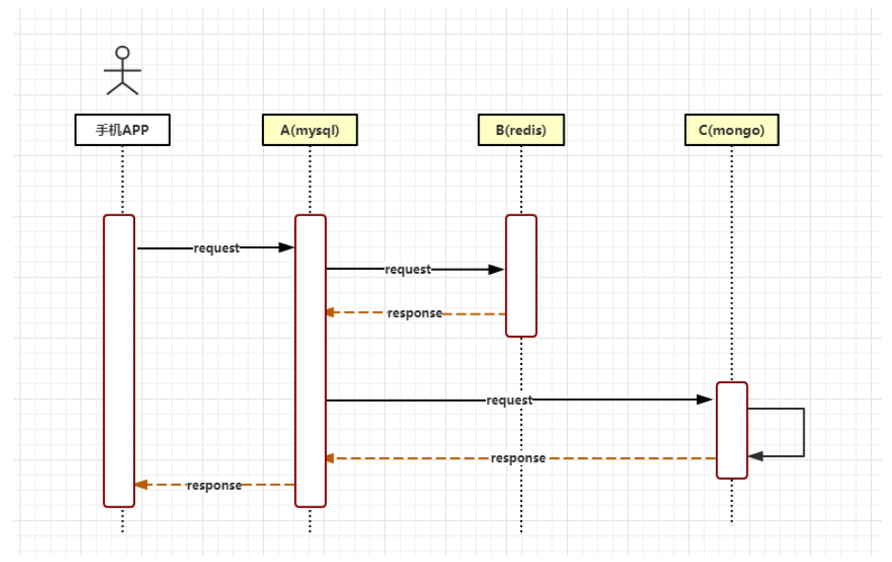

​	若采用TX-LCN分布式事务框架，则可以将A模块采用LCN模式、B/C采用TCC模式就能完美解决。

2、根据资料总结一下各分布式事务模式的特点。

备注：海信HICS团队对不使用消息中间件的分布式事务处理模式进行了压力测试，结果可作公司选型参考。具体见: <http://springcloud.cn/view/374>

------

##### LCN事务模式

##### LCN原理：

LCN模式是通过代理Connection的方式实现对本地事务的操作，然后在由TxManager统一协调控制事务。当本地事务提交回滚或者关闭连接时将会执行假操作，该代理的连接将由LCN连接池管理。

##### 模式特点:

- 该模式对代码的嵌入性为低。
- 该模式仅限于本地存在连接对象且可通过连接对象控制事务的模块。
- 该模式下的事务提交与回滚是由本地事务方控制，对于数据一致性上有较高的保障。
- 该模式缺陷在于代理的连接需要随事务发起方一共释放连接，增加了连接占用的时间。

------

##### TCC事务模式

##### TCC原理:

​    TCC事务机制相对于传统事务机制（X/Open XA Two-Phase-Commit），其特征在于它不依赖资源管理器(RM)对XA的支持，而是通过对（由业务系统提供的）业务逻辑的调度来实现分布式事务。主要由三步操作，Try: 尝试执行业务、 Confirm:确认执行业务、 Cancel: 取消执行业务。

##### 模式特点:

- 该模式对代码的嵌入性高，要求每个业务需要写三种步骤的操作。
- 该模式对有无本地事务控制都可以支持使用面广。
- 数据一致性控制几乎完全由开发者控制，对业务开发难度要求高。

------

##### TXC事务模式

##### TXC原理：

​    TXC模式命名来源于淘宝，实现原理是在执行SQL之前，先查询SQL的影响数据，然后保存执行的SQL快走信息和创建锁。当需要回滚的时候就采用这些记录数据回滚数据库，目前锁实现依赖redis分布式锁控制。

##### 模式特点:

- 该模式同样对代码的嵌入性低。
- 该模式仅限于对支持SQL方式的模块支持。
- 该模式由于每次执行SQL之前需要先查询影响数据，因此相比LCN模式消耗资源与时间要多。
- 该模式不会占用数据库的连接资源。

------

##### 七、扩展

​	对于常见的微服务系统，大部分接口调用是同步的，也就是一个服务接口直接调用另外一个服务的接口。这个时候，用TCC或TX-LCN等分布式事务方案来保证各个接口的调用时可行的。

​	但在实际开发的过程中，可能服务间的调用是异步的。也就是说，一个服务发送一个消息给MQ，即消息中间件，比如RocketMQ、RabbitMQ、Kakfa、ActiveMQ等等。然后，另一个服务从MQ消费到一条消息后进行处理。这就成了基于MQ的异步调用了。这个时候，就要用上可靠消息最终一致性方案，来实现分布式事务。

**可靠消息最终一致性方案的核心流程**： 见原文：<http://www.cnblogs.com/jajian/p/10014145.html>

------

##### 八、参考资料

1. TX-LCN分布式事务框架： https://txlcn.org/zh-cn/index.html 
2. Spring Cloud的分布式事务框架压测第一轮：http://springcloud.cn/view/374
3. 终于有人把“TCC分布式事务”实现原理讲明白了：http://www.cnblogs.com/jajian/p/10014145.html

